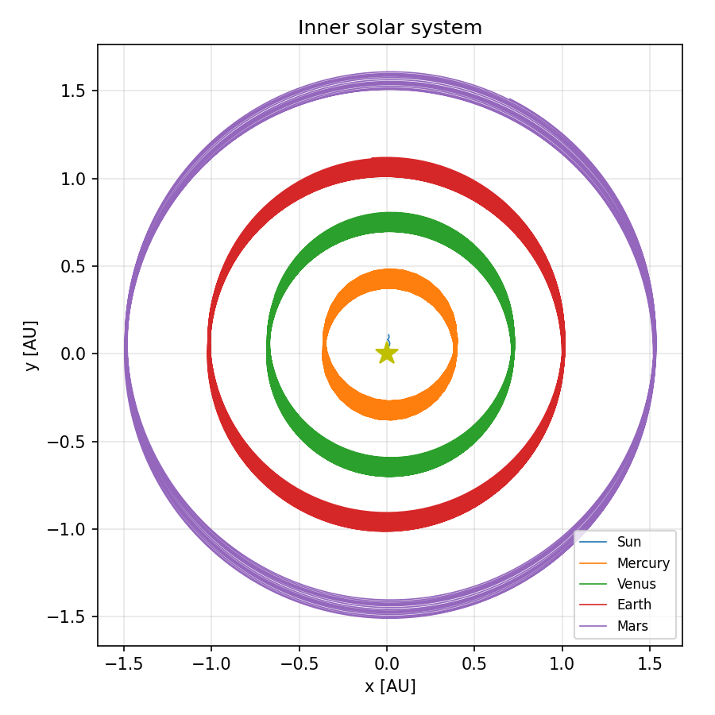
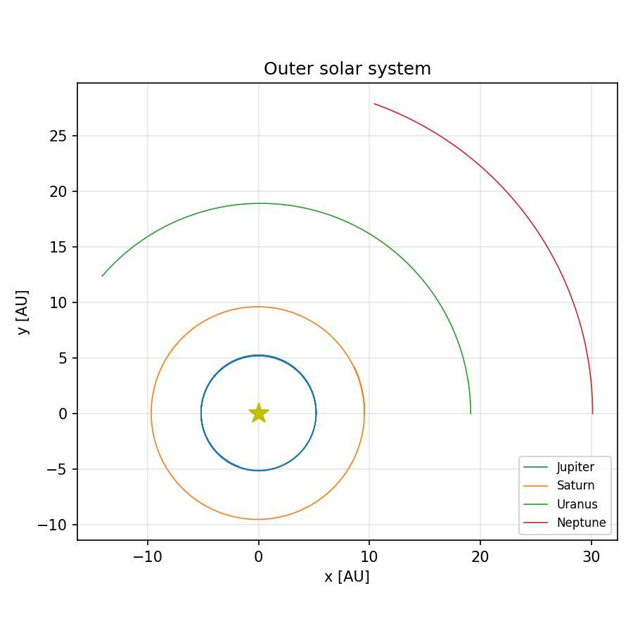
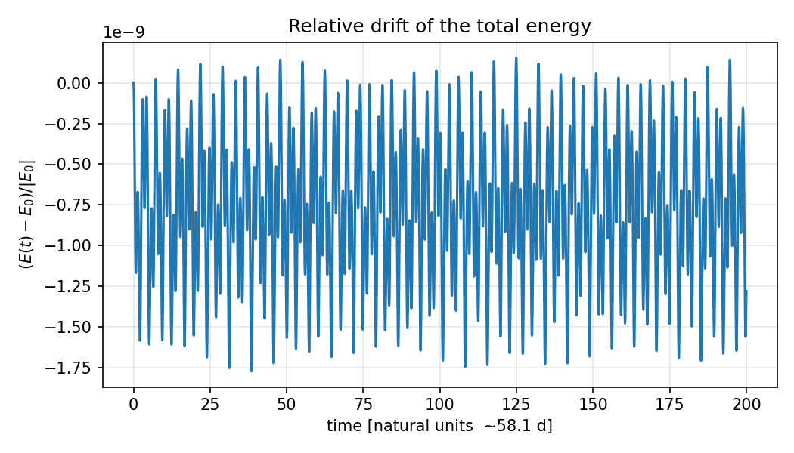
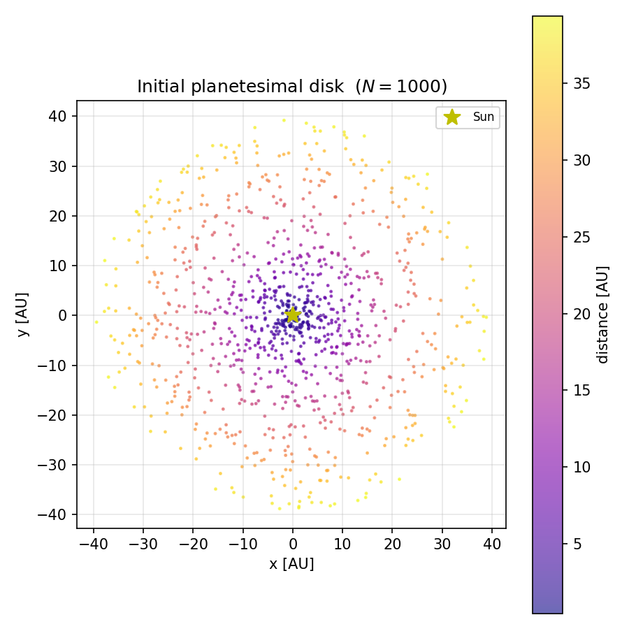
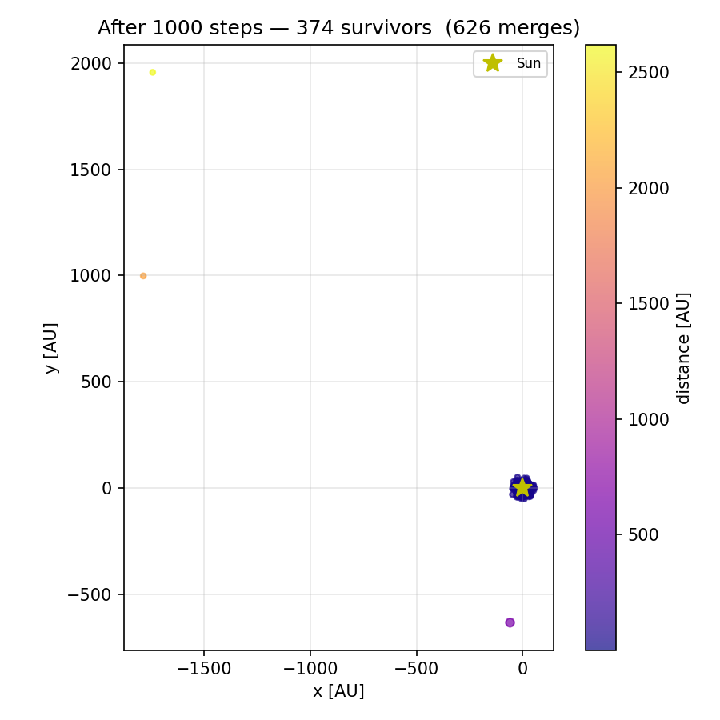
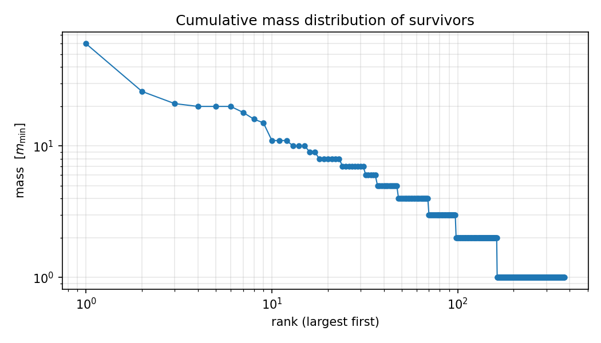
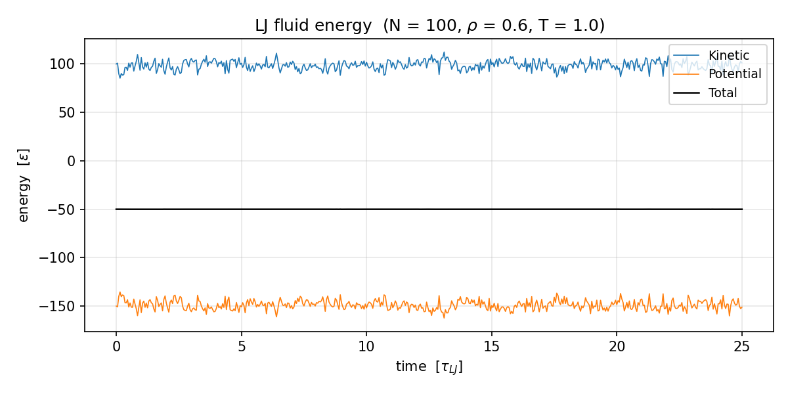
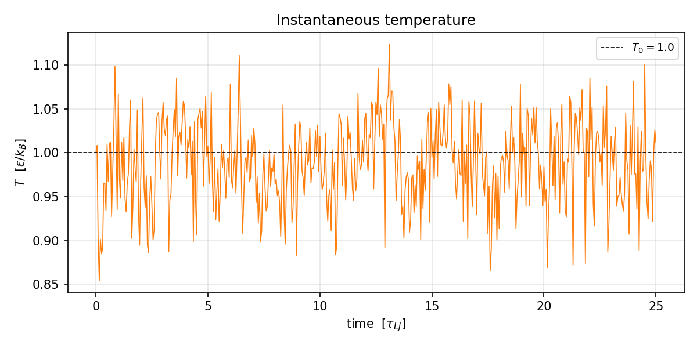
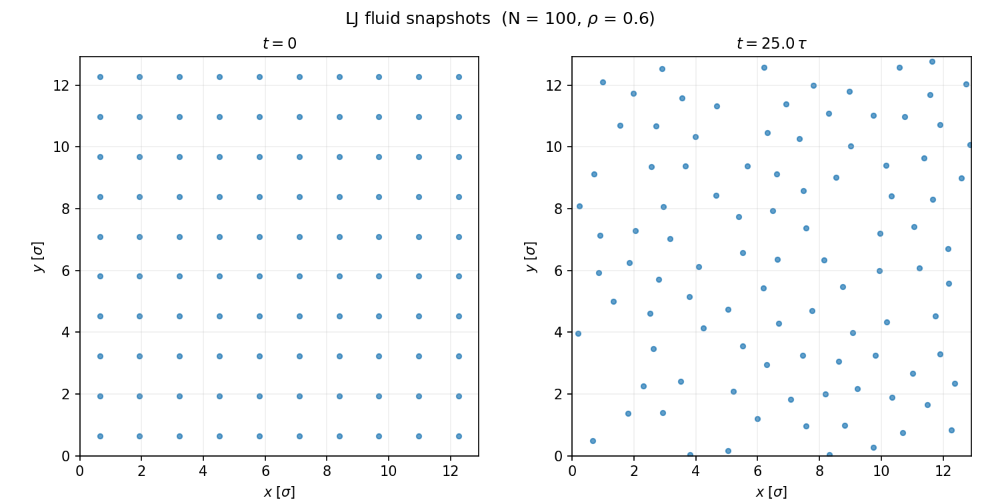
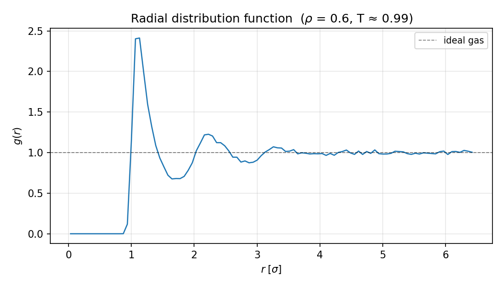

# N-body problem applied to molecular and planetary dynamics

Two classical N-body simulations implemented in Python with Numba-accelerated Velocity-Verlet integration:

1. **Solar System** — gravitational N-body integrator for the 8-planet Solar System, plus a planet-formation model with inelastic collisions between planetesimals.
2. **Molecular Dynamics** — 2D Lennard-Jones fluid with periodic boundary conditions; tracks energy conservation, temperature, and radial distribution function.

---

## Repository layout

```
├── solar_system/
│   ├── initial_conditions.py   # Sun + 8-planet ICs (heliocentric units, G M_sun = 1)
│   ├── verlet.py               # Velocity-Verlet N-body integrator + period measurement
│   └── formation.py            # Planetesimal disk formation model
├── molecular_dynamics/
│   └── lj.py                   # 2D Lennard-Jones fluid (Velocity-Verlet, PBC)
├── scripts/
│   ├── run_solar_system.py     # Integrate the 8-planet system → 3 figures
│   ├── run_formation.py        # Planetesimal formation → 3 figures
│   └── run_md.py               # LJ simulation → 4 figures
└── figures/                    # All PNG outputs (generated by the scripts)
```

---

## Physics

### Solar System (heliocentric units)

Natural units with $G M_\odot = 1$, $[\ell] = 1\ \text{AU}$, $[t] \approx 58.1\ \text{days}$ (so $T_\oplus = 2\pi$). Kepler's third law becomes $T^2 = (2\pi)^2 a^3$.

The **Velocity-Verlet** scheme preserves the symplectic structure of Hamiltonian mechanics; the global energy drift scales as $O(\Delta t^2)$:

$$
\mathbf{r}(t+\Delta t) = \mathbf{r}(t) + \mathbf{v}(t)\,\Delta t + \tfrac{1}{2}\mathbf{a}(t)\,\Delta t^2
$$
$$
\mathbf{v}(t+\Delta t) = \mathbf{v}(t) + \tfrac{1}{2}\bigl[\mathbf{a}(t)+\mathbf{a}(t+\Delta t)\bigr]\,\Delta t
$$

### Planet formation

A disk of $N = 1000$ equal-mass planetesimals orbits the Sun on slightly non-circular orbits. At each step: (i) bodies advance under the Sun's gravity alone; (ii) any pair within their combined radius undergoes a **perfectly inelastic** collision that conserves linear momentum and assumes constant density after merging:

$$
R_{\rm new} = \left(R_i^3 + R_j^3\right)^{1/3}, \qquad \mathbf{v}_{\rm new} = \frac{m_i\,\mathbf{v}_i + m_j\,\mathbf{v}_j}{m_i + m_j}
$$

### Lennard-Jones fluid (reduced units $\varepsilon = \sigma = m = k_B = 1$)

$$
V(r) = 4\!\left[\left(\frac{1}{r}\right)^{12} - \left(\frac{1}{r}\right)^{6}\right], \quad r < r_{\rm cut} = 2.5\,\sigma
$$

The potential is **shifted** so $V(r_{\rm cut}) = 0$. Forces use the **minimum-image convention** for periodic boundary conditions. Instantaneous temperature in 2D: $T = \langle v^2 \rangle / 2$ per particle.
---
## Results

### Solar System — orbits

Integrated for 200 000 steps ($\Delta t = 10^{-3}$). Relative energy drift: $\max|dE/E_0| = 1.8 \times 10^{-9}$.

| | |
|:---:|:---:|
|  |  |
| Inner Solar System (Mercury – Mars) | Outer Solar System (Jupiter – Neptune) |



#### Orbital periods

| Planet | Numerical [d] | Real [d] | Error |
|--------|:-------------:|:--------:|:-----:|
| Mercury | 84.4 | 88.0 | 4.1 % |
| Venus | 213.4 | 224.7 | 5.0 % |
| Earth | 371.7 | 365.2 | 1.8 % |
| Mars | 676.4 | 687.0 | 1.5 % |
| Jupiter | 4 310 | 4 331 | 0.5 % |
| Saturn | 10 843 | 10 747 | 0.9 % |

The small period errors for the inner planets arise from the initial conditions placing all bodies on the +x axis — the asymmetric start introduces a transient that averages out after several orbits.
---
### Planet formation — 1 000 planetesimals, 1 000 steps

626 merges reduce the initial disk from 1 000 to **374 surviving bodies**.

| | |
|:---:|:---:|
|  |  |
| Initial planetesimal disk (coloured by distance) | Survivors after merging (symbol area ∝ mass) |



The cumulative mass distribution shows a power-law tail: a few massive bodies accrete most of the material near the inner disk, while the outer disk remains largely unmerged.
---
### Lennard-Jones fluid — $N = 100$, $\rho^* = 0.6$, $T^* = 1.0$

5 000 steps with $\Delta t = 0.005\,\tau$. Relative energy drift: $\max|dE/E_0| = 1.3 \times 10^{-3}$.

| | |
|:---:|:---:|
|  |  |
| Kinetic, potential and total energy | Instantaneous temperature |

| | |
|:---:|:---:|
|  |  |
| Particle positions at $t=0$ and $t=t_{\rm end}$ | Radial distribution function $g(r)$ |

The RDF shows a pronounced first peak near $r \approx 1.1\,\sigma$ (the LJ potential minimum) and oscillations that decay to 1, consistent with a dense liquid phase at $\rho^* = 0.6$, $T^* = 1.0$.
---
## Usage

```bash
pip install numpy numba matplotlib
```

```bash
python scripts/run_solar_system.py
python scripts/run_formation.py
python scripts/run_md.py
```

All scripts write output to `figures/` and print a summary to stdout.

> **Numba JIT compilation**: the first run compiles the hot loops (~10–30 s). Subsequent runs use the cached bytecode and are significantly faster.
---
## Author

**A. S. Amari Rabah**

Developed as part of the coursework for *Computational Physics* —
Bachelor's Degree in Physics, University of Granada, Spain.